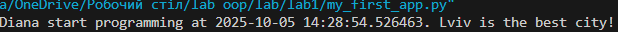

# Звіт до роботи
## Тема: _налаштування середовища, прочаток роботи з Python та Markdown;_
### Мета роботи: _налаштувати середовище роботи VS Code, створити репозиторій Github та налаштувати інтеграцію з ним, написати першу програму на Python та створити звіт з використанням форматування Markdown;_

---
### Виконання роботи
* Результати виконання завдання:
    1. Створила заготовку для звіту та перші файли Python ;
    1. Інсталювала плагіни та почала працювати з VSCode
    1. Запитала в АІ про першу програму
    
    1. запустити програму з консолі не вийшло
    1. Зробила ноутбук та запустила код в ньому [Посилання](C:\Users\diana\OneDrive\Робочий стіл\lab oop\lab\lab1\1app.ipynb)

* не виходить виконати завдання із кодами, також не можу вставити посилання на ноутбук

---
### Висновок:

-  Що зроблено в роботі: пробувала налаштувати правильно середовище, не дуже вийшло
-  Чи досягнуто мети роботи: ні
-  Які нові знання отримано: застосувала на практиці роботу з markdown
-  Чи вдалось відповісти на всі питання задані в ході роботи: ні
-  Чи вдалося виконати всі завдання:ні
- Чи виникли складності у виконанні завдання: так, труднощі почались на етапі запуску коду з консолі

---